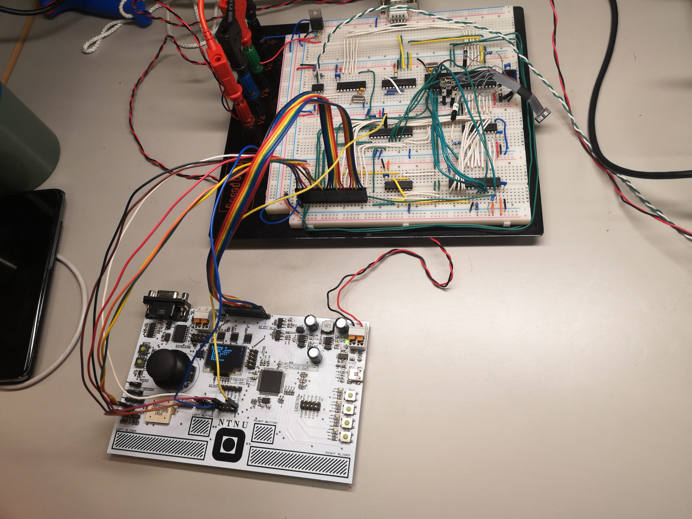
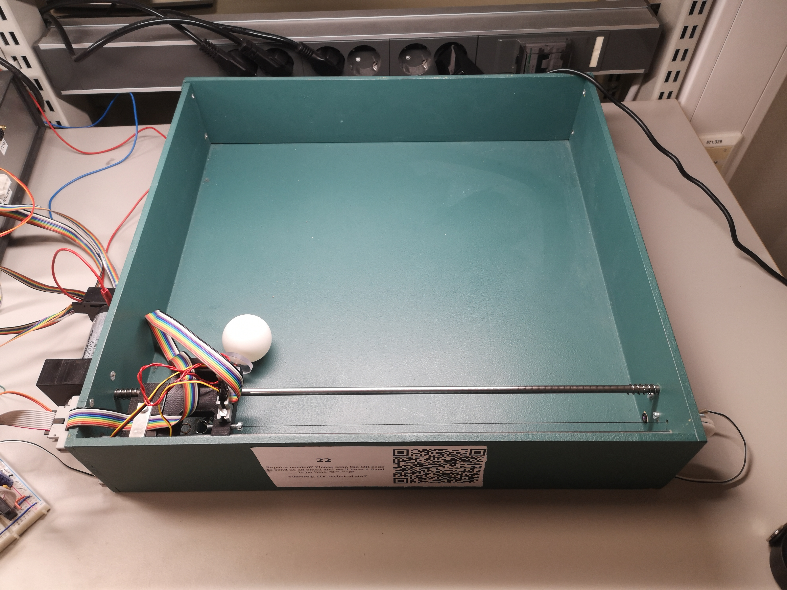

.. _byggern-home:

Byggern 2022 documentation
############################

Welcome to the documentation of TTK4155 Ping Pong source code.
This is the API documentation of the Ping Pong game developed in the course
TTK4155 (also known as "Byggern").

The Ping Pong game is built on two modules with each own source code that
independently controls part of the system and communicates over CAN.

Node 1 receives control data and sends these to Node 2.
Node 2 controls the Ping-Pong board.
The Ping-Pong board has a servo, a solenoid and a motor that you can play
ping-pong with.

   Node 1

.. figure:: ./images/node2.jpg
   :width: 70%
   :alt: node2

   Node 2

   Ping Pong board

Nodes
********

.. toctree::
   :maxdepth: 4
   :caption: Nodes

   ./node1/index.rst
   ./node2/index.rst
